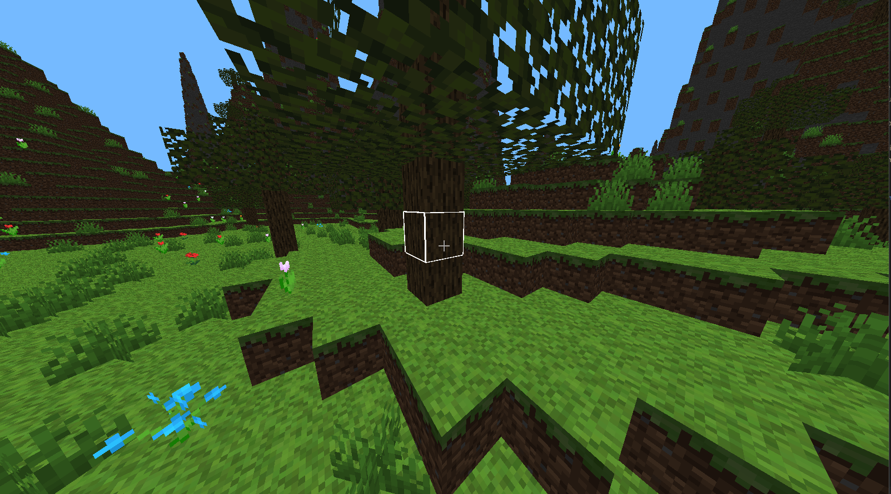
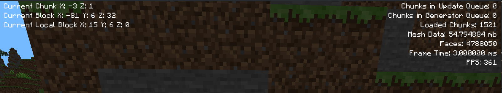
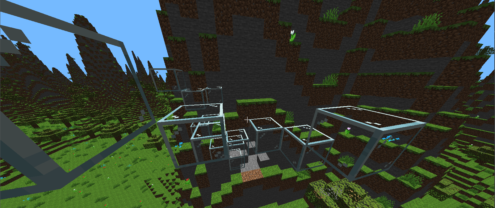

# OpenGL C++ Minecraft Clone

A lightweight voxel engine and Minecraft clone built using OpenGL and C++.

> **Disclaimer**  
> This is an old, archived codebase that is no longer maintained. It was originally written when I was 16 years old as a learning playground for C++ and OpenGL. The code reflects that early learning phase and contains outdated code, unoptimized structures, and bad practices. Recent updates are limited to minor compatibility fixes and adding architectural documentation.

## Demos





---

## Technical Architecture & Rendering Engine

The engine utilizes several advanced OpenGL techniques designed to optimize rendering throughput, minimize CPU-to-GPU data transfer, and achieve stutter-free chunk generation.

### 1. Zero-Attribute Instanced Rendering
Instead of using traditional Vertex Buffer Objects (VBOs) containing redundant 3D vertex positions, texture coordinates, and normals for every block face, the engine uses **Zero-Attribute Instanced Rendering**.
- Each face is drawn as an instance of a 4-vertex quad using `GL_TRIANGLE_STRIP`.
- The draw call is executed as:
  ```cpp
  glDrawArraysInstanced(GL_TRIANGLE_STRIP, 0, 4, numFaces);
  ```
- The Vertex Shader relies entirely on `gl_VertexID` (0 to 3) to generate the relative corner coordinates of the quad and `gl_InstanceID` to index into the face data.

### 2. Bit-Packed Face Data (SSBO)
All parameters describing a visible block face are packed on the CPU into exactly **three 32-bit integers (96 bits / 12 bytes total per face)**. This packed data is stored in a Shader Storage Buffer Object (SSBO) bound to layout binding `0`.

The vertex shader extracts and decodes the packed information using bitwise operations:

* **First Integer (`data[gl_InstanceID * 3]`)**:
  - `blockX` (8 bits): X-coordinate within the chunk (0-31).
  - `blockY` (8 bits): Y-coordinate (0-255).
  - `blockZ` (8 bits): Z-coordinate within the chunk (0-31).
  - `faceType` (4 bits): Direction/orientation of the face (0 = Front, 1 = Back, 2 = Left, 3 = Right, 4 = Top, 5 = Bottom, 6/7 = Diagonal crosses for foliage).
  - `lightLevel` (4 bits): Light value.

* **Second Integer (`data[gl_InstanceID * 3 + 1]`)**:
  - `textureIndex` (8 bits): Index in the 2D texture array.
  - `width` (8 bits): Horizontal scaling/repeat of the face.
  - `height` (8 bits): Vertical scaling/repeat of the face.

* **Third Integer (`data[gl_InstanceID * 3 + 2]`)**:
  - `offsetX`, `offsetY`, `offsetZ` (8 bits each, signed): Positional offsets for non-standard blocks.

```glsl
// Example decoding in Vertex Shader
int blockX = (data[gl_InstanceID * 3] & 0xFF000000) >> 24;
int blockY = (data[gl_InstanceID * 3] & 0x00FF0000) >> 16;
int blockZ = (data[gl_InstanceID * 3] & 0x0000FF00) >> 8;
int face   = (data[gl_InstanceID * 3] & 0x000000F0) >> 4;
```

This compact format significantly reduces PCIe bandwidth and GPU memory usage.

### 3. Hidden-Face Culling (CPU-side)
When a chunk mesh is updated, the CPU checks all neighboring blocks (including across chunk boundaries). Faces that are occluded by adjacent solid blocks are discarded.
- Only visible faces are compiled into the SSBO buffer.
- The engine separates culled faces (rendered with back-face culling `GL_CULL_FACE` active) from non-culled faces (e.g., glass, grass, and flowers, which are drawn with culling disabled).

### 4. Texture Arrays (`sampler2DArray`)
To avoid the CPU overhead of binding different textures during rendering, the engine loads all block and UI textures into a single `sampler2DArray`.
- The fragment shader samples the array dynamically using the `TextureIndex` decoded from the instance data:
  ```glsl
  outColor = texture(image, vec3(TextureCoords, TextureIndex));
  ```
- This allows the entire chunk's solid geometry to be rendered in a single draw call.

### 5. Multi-threaded World Pipeline
Chunk generation and meshing are offloaded to background thread pools using the `ChunkGenerator` and `ChunkUpdater` classes. This ensures that world loading and block updates do not block the main rendering thread, maintaining a smooth frame rate.

---

## Block Configuration & API

The engine loads block properties and visual layouts dynamically from JSON configurations at runtime.

### How to Add a New Block

1. **Add the Texture:**  
   Place the block's texture `.png` file in the `Assets/textures/blocks/` directory.

2. **Register the Resource:**  
   Edit [Assets/resources.json](file:///home/konrad/Documents/Minecraft/Assets/resources.json) to declare the texture and associate it with a model JSON file:
   - Under `"FaceTextures"`, map a texture identifier to your `.png` filename:
     ```json
     "my_block_texture": "my_block.png"
     ```
   - Under `"BlockModels"`, append the filename of your block's model configuration:
     ```json
     "my_block.json"
     ```

3. **Define the Block Model:**  
   Create the model configuration file `Assets/models/my_block.json`.

### Block Model JSON Schema

Here is an example block definition showing the schema fields:

```json
{
  "id": 13,
  "name": "blue_orchid",
  "solid": false,
  "transparent": true,
  "faces": [
    {
      "type": "rotated_left",
      "texture": "blue_orchid",
      "cull": false
    },
    {
      "type": "rotated_right",
      "texture": "blue_orchid",
      "cull": false
    }
  ]
}
```

#### Field Specifications:
- **`id`** (integer, required): Unique block ID (e.g. `0` is reserved for Air).
- **`name`** (string): User-friendly internal name for the block.
- **`solid`** (boolean, optional, default: `true`): If `true`, the block is physically solid and blocks collision/movement.
- **`transparent`** (boolean, optional, default: `false`): If `true`, faces of neighboring blocks will not be occluded by this block. Set to `true` for glass or foliage.
- **`transparency`** (integer, optional): Custom transparency levels (e.g. `15` for air).
- **`faces`** (array): List of face elements forming the block model.
  - **`type`** (string): One of `"top"`, `"bottom"`, `"left"`, `"right"`, `"front"`, `"back"`, `"rotated_left"`, or `"rotated_right"` (the rotated types are used for diagonal billboard crosses like flowers and grass).
  - **`texture`** (string): The texture name identifier registered in `resources.json`.
  - **`cull`** (boolean, optional, default: `true`): If `false`, disables backface culling for this specific face (essential for diagonal plant crosses or glass).
  - **`width` / `height`** (unsigned integer, optional, default: `16`): The pixel scale/dimensions of the face.
  - **`offsetX` / `offsetY` / `offsetZ`** (integer, optional, default: `0`): Signed offsets to shift the face vertices dynamically.

---

## Dependencies & Building

The project uses **Conan 2** for managing external C++ dependencies and **CMake** for configuration.

### Prerequisites
- A C++ compiler (supporting C++20 or newer)
- CMake 3.20 or newer
- Conan 2.x

### Build Instructions

1. **Install Conan Dependencies:**
   ```bash
   conan install . --build=missing
   ```
   This pulls and compiles the required libraries: `glfw`, `glad`, `glm`, `stb`, `nlohmann_json`, and `fastnoise2`.

2. **Configure CMake:**
   Use the toolchain file generated by Conan:
   ```bash
   cmake -S . -B build -DCMAKE_TOOLCHAIN_FILE=build/Release/generators/conan_toolchain.cmake -DCMAKE_BUILD_TYPE=Release
   ```

3. **Build the Project:**
   ```bash
   cmake --build build
   ```

---

## How to Run

Because asset paths (textures, shaders, fonts) are loaded relative to the binary's execution directory using `../Assets/`, the game must be run from the `build` directory:

```bash
cd build
./Minecraft
```
